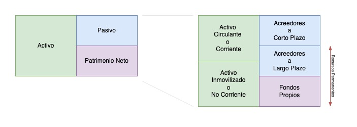
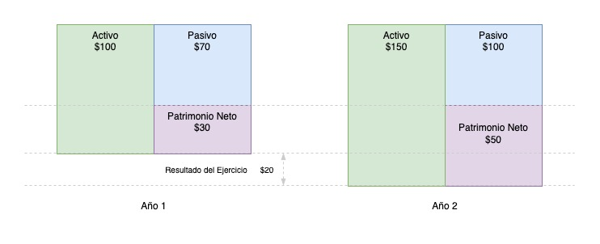
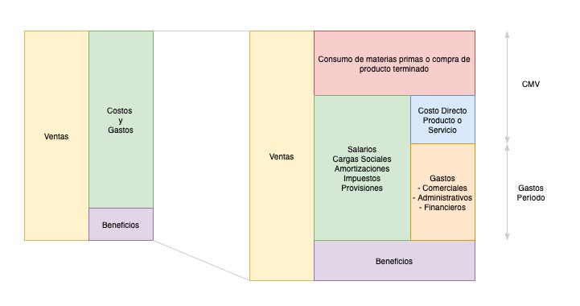
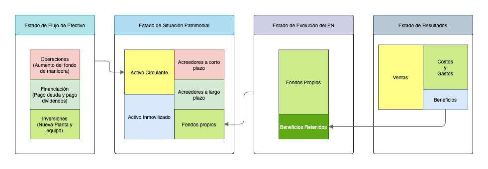

# Contabilidad Tradicional
Técnica que procesa y brinda información sobre el patrimonio de una empresa y sobre los hechos económicos que lo afectan para la toma de decisiones.

**Contabilidad Tradicional o Financiera** 
- Balance General
- Estado de Resultados
- Estado de Flujo de Fondos
- Estado de Evolución del Patrimonio Neto
- Información Pública
  - Accionistas
  - La dirección de la empresa
  - Acreedores
  - Clientes/Proveedores
  - Empleados
  - Gobiernos
  - Sindicatos
  - Analistas Financieros
  - Inversores

**Contabilidad de Gestión**
- Costos
- Rentabilidad por Unidad de Negocio
- Rentabilidad por producto
- Rentabilidad por cliente
- Información Privada
  - La dirección de la empresa
  - Áreas operativas

___

## Estado Patrimonial

$$ [Activo] = [Pasivo] + [PatrimonioNeto]$$

$$ ([ActivoCorriente] + [ActivoNoCorriente]) = ([PasivosCortoPlazo] + ([PasivosLargoPlazo] + [PatrimonioNeto])$$

### Cuadro de Resultado

**Resultado del ejercicio anterior (ganancias o pérdidas)**

$$ [Resultado] = [Ingresos] - [Egresos]$$

___

## Cash Flow
Se  compone de:  
**Operaciones**  
- Cobranzas a Clientes
- Pagos a empleados
- PProveedores
- Estado
- Otros

**Financiación**
- Obtención o pago de deuda
- Aporte de Capital
- Pago de Dividendos

**Inversiones**
- Inmuebles
- Equipos
- Productos
- TIC

### **Estado de Evolución del Patrimonio Neto**
- **Resultado**
  - Ganancias (+)
  - Perdidas (-)
- **Dividendos**
  - Dividendos Pagados (-)
- **Aporte de Capital**
  - Aporte (+)

### **Relación entre Estados Contables**

___

## Análisis de Estado Contable
**Análisis de Balance**
- Índices (indicadores)
- Análisis horizontal (Comparaciones horizontales)
- Análisis vertical (Comparación de proporciones)
- Análisis de tendencias
- Benchmarking (compararse con la industria o con otras empresas)

| Análisis                             | Fórmula                                                                               |
| ------------------------------------ | ------------------------------------------------------------------------------------- |
| Liquidez                             | $$[Liquidez] = \frac{[ActivoCorriente]}{[PasivoCorriente]}$$                          |
| Prueba Ácida                         | $$[PruebaAcida] = \frac{[Caja] + [ActivosFacilmenteRealizables]}{[PasivoCorriente]}$$ |
| Apalancamiento                       | $$[Apalancamiento] = \frac{[Pasivo]}{[Pasivo]+[PatrimonioNeto]}$$                     |
| Rotación                             | $$[EficienciaInventario] = \frac{CMV}{PromedioExistencia}$$                           |
| Días de Ventas en existencia         | $$[existencia] = \frac{[PromedioExistencia]}{[CMV]} . 365$$                           |
| Retorno sobre Activos - ROA          | $$[ROA] = \frac{[BeneficioNeto]}{[ActivosTotales]}$$                                  |
| Rotación de créditos por inventarios | $$[RCI] = \frac{[Ventas]}{[PromedioCreditos]}.[Inventarios]$$                         |
| Días de Crédito en la calle          | $$[DCC] = \frac{[PromedioCreditos]}{Ventas}.365$$                                     |

___

## Proceso Contable
**Operaciones Contables**  
- Permutativas
  - No originan cambios en el PN
  - Son Patrimoniales, ejemplo: extracción del cajero
- Modificativas
  - Originan cambios en el PN
  - Resultados del ejercicio **(Resultado)**
  - Aporte de Capital **(Movimiento de Capital)**
  - Distribución de Utilidades **(Movimiento de Capital)**

___

## Patrimonial / Resultado
**Movimientos Patrimoniale - Percibido**
- Depositos y extracciones bancarias
- Compras al contado y a plazo
- Cobranzas de clientes
- Pagos a proveedores
- Obtención de préstamos
- Pago de deudas o préstamos
- Pago de inversiones

**Movimientos de Resultado - Devengado o percibido**
- Ventas y sus costos
- Amortizaciones
- Revaluaciones y devaluaciones
- Devengamiento de intereses
- Otros ingresos y gastos

___

## Operaciones, Libros Contables, Cuentas y Rubros

### Cuentas
Es el nombre que se le asigna a un grupo de valores patrimoniales.

### Libro Diario
Registro completo y cronológico de todas la operaciones
- Registros de cada operación
- Asiento de diario
  
### Libro Mayor
???

### Operaciones 
**Operaciones Básicas**  
- Comprar
- Vender
- Incurrir en gastos
- Cobrar
- Pagar

**Operaciones Complementarias**
- Devengamientos y diferimentos
- Amortizaciones
- Revaluaciones y devaluaciones

| Cuenta          | Patrimoniales | Resultado |
| --------------- | ------------- | --------- |
| Activo          | X             |           |
| Pasivo          | X             |           |
| Patrimonio Neto | X             |           |
| Gastos(-)       |               | X         |
| Ingresos (+)    |               | X         |

### Cuentas del Activo
### Cuentas del Pasivo
### Cuentas del Patrimonio Neto
### Plan de Cuentas
### Apertura de Cuentas
### Proceso Contable
### Balance General
### Relación entre estados
___

## EBIT y EBITDA

El ebitda​ es un indicador financiero del beneficio bruto de explotación calculado antes de la deducibilidad de los gastos financieros. Se calcula en base al resultado final de explotación de una empresa, dejando fuera los gastos por intereses o impuestos, y las disminuciones de valor por depreciaciones o amortizaciones, reflejando el resultado puro de la empresa